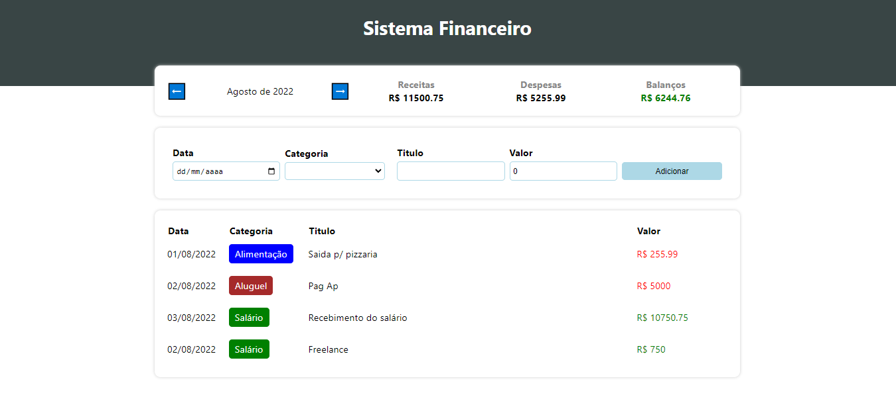

# EXPANSE TRACKER

  

## Objetivo:

### Foi criar um gestor de receitas e despesas mensais.

## Descrição:

- `Projeto feito com React JS + typescript`
- `Nele é possivel adicionar uma despesa ou receita por categoria ja pré definida`
- `O balanço já é calculado automaticamente de acordo com campo adicionado`

## <i>Douglas Monteiro</i> 😁🔥🚀
